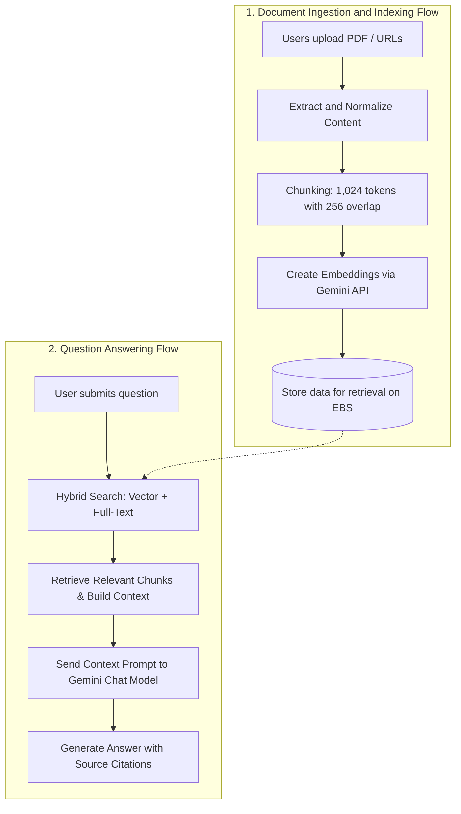
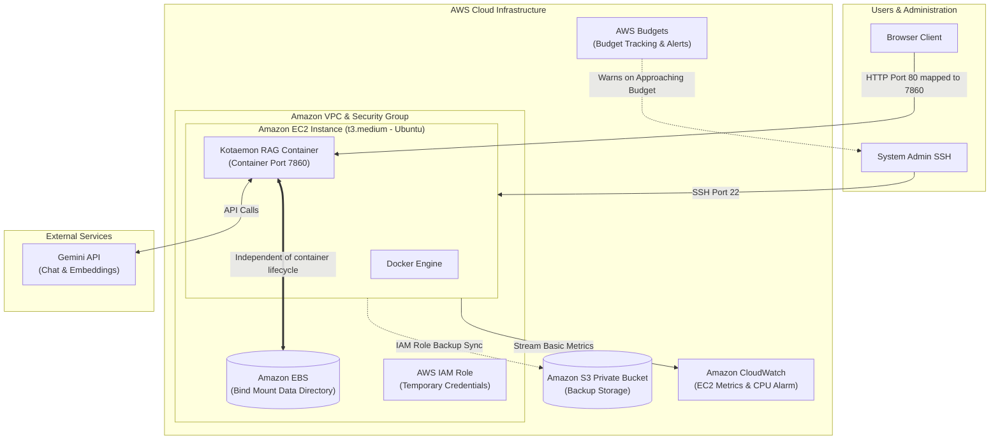

## Deploying Kotaemon RAG Chat on AWS

---

### 1. Team Information

The project is developed as part of the **First Cloud AI Journey – AWS Workforce Bootcamp** by a team of students from **Saigon University**.

#### Team Members:
* **Đàm Thị Ngọc Châu**
* **Phan Thị Hồng Nhiên**
* **Võ Hoàng Kim Quyên**
* **Phan Thị Hải Vân**
* **Lê Gia Hân**

#### GitHub Repository:
* View the **FCAJ RAG Chat** repository on GitHub: [https://github.com/ngocchau04/fcaj-rag-chat](https://github.com/ngocchau04/fcaj-rag-chat)

---

### 2. Overview

This project proposes deploying the **Kotaemon RAG Chat system on AWS**. **Kotaemon** is an open-source application that allows users to upload documents and ask questions about their content. The team will configure **Gemini models** for chat and embeddings, package the application with **Docker**, and establish deployment, persistent storage, backup, monitoring, and cost-control processes on AWS.

The system will run on a single **Amazon EC2 t3.medium** instance. Application data will be separated from the container lifecycle and stored on **Amazon EBS**, while backups will be synchronized to a private **Amazon S3** bucket through an **IAM Role**. **Amazon CloudWatch** will monitor basic EC2 metrics, and **AWS Budgets** will support cost control. **Gemini API** will provide chat and embedding capabilities as a service external to AWS.

The architecture targets a learning and demonstration environment, prioritizing simplicity, reproducibility, and low cost rather than immediate production readiness.

---

### 3. Background and Problem

Running a RAG application only on a local computer limits access and makes demonstrations difficult. Moving the application to the cloud makes it accessible through a browser but introduces requirements for persistent storage, backup, access control, monitoring, and cost management.

A container may be stopped, deleted, or recreated during operation. If all application data remains inside the container’s writable layer, uploaded documents, databases, and vector indexes may be lost. The project therefore separates important data onto **EBS** and maintains an independent backup in **S3**.

---

### 4. Objectives

* Deploy the Kotaemon interface on Amazon EC2 for browser access.
* Package the application with Docker for a consistent deployment environment.
* Configure Gemini API for chat and embeddings.
* Preserve application data when the container restarts or is recreated.
* Back up important data from EBS to S3 through an IAM Role without storing long-term access keys on the server.
* Monitor EC2 with CloudWatch and control spending with AWS Budgets.
* Define startup, validation, troubleshooting, backup, and cleanup procedures.
* Document the limitations of the demo architecture and propose a realistic improvement roadmap.

---

### 5. RAG Processing Flow

The system consists of two main flows:

1. **Document ingestion and indexing:** Users upload PDF files or provide URLs. The system normalizes the content, splits it into chunks of approximately 1,024 tokens with a 256-token overlap, creates Gemini embeddings, and stores the data for retrieval.
2. **Question answering:** The system performs hybrid retrieval using vector and full-text search, selects relevant chunks, constructs context, and sends it to the chat model to generate an answer with source citations.

---

### 6. Proposed Solution Architecture

#### Main Components:
* **Amazon EC2:** Runs Ubuntu, Docker, and Kotaemon. EC2 port 80 maps to the application’s container port 7860.
* **Amazon EBS:** Stores Kotaemon application data through a bind mount, making it independent of the container lifecycle.
* **Amazon S3:** Stores backups in a private bucket with Block Public Access and server-side encryption.
* **AWS IAM:** Provides an IAM Role for temporary EC2 access to S3.
* **Amazon VPC and Security Group:** Control access to EC2 for administration and the demo interface.
* **Amazon CloudWatch:** Monitors EC2 metrics and provides a CPU threshold alarm.
* **AWS Budgets:** Tracks project spending and warns when usage approaches the budget.
* **Gemini API:** An external service used for chat and embeddings.

---

### 7. Scope

#### In Scope:
* One EC2 instance running Docker and Kotaemon.
* EBS-backed application data through a bind mount.
* Private S3 backups.
* IAM Role access from EC2 to S3.
* Basic CloudWatch metrics and a CPU alarm.
* AWS Budgets for cost awareness.
* HTTP access through a public IPv4 address for demonstration.
* Gemini API for chat and embeddings.

#### Outside the Initial Scope:
* Multi-instance clusters, High Availability, or Auto Scaling.
* HTTPS, a custom domain, AWS WAF, and an Application Load Balancer.
* Amazon ECS Fargate, Amazon ECR, Amazon EFS, and NAT Gateway.
* CloudWatch Agent, centralized application logs, and complete tracing.
* Scheduled backups and periodic recovery testing.
* Quantitative RAG evaluation using a standard question set.

---

### 8. Implementation Plan

| Phase | Milestone Deliverables |
|:---|:---|
| **Phase 1 – Application Preparation** | - Run Kotaemon with Docker locally. - Configure Gemini for chat and embeddings. - Verify document upload, indexing, question answering, and citations. |
| **Phase 2 – AWS Infrastructure** | - Create a budget and select an appropriate AWS Region. - Launch an EC2 `t3.medium` instance with EBS and a Security Group. - Attach an IAM Role to EC2 and create a private S3 bucket. |
| **Phase 3 – Deployment and Storage** | - Install Docker, Git, and AWS CLI on EC2. - Build and run the Kotaemon container. - Configure an EBS bind mount for persistent application data. - Synchronize important data from EBS to S3. |
| **Phase 4 – Monitoring and Validation** | - Monitor EC2 with CloudWatch and configure a CPU alarm. - Validate interface access, data persistence, and backup behavior. - Review IAM permissions, S3 privacy, and API key handling. - Capture deployment evidence and complete operational documentation. |

---

### 9. Risks and Mitigations

* **Insufficient EC2 resources:** Use `t3.medium`, limit document size, and monitor resource usage.
* **Unexpected container termination:** Configure a restart policy and review logs during recovery.
* **Data loss after container recreation:** Use an EBS bind mount and maintain backups in S3.
* **Gemini API quota errors:** Control request rates, implement appropriate retries, and prepare a fallback strategy.
* **Exposed API keys:** Exclude `.env` from version control, restrict access, and rotate keys when necessary.
* **Unexpected costs:** Configure AWS Budgets, stop EC2 when unused, and clean up resources after the demo.
* **Public S3 access:** Enable Block Public Access and review bucket policies.

---

### 10. Expected Outcomes

* A demonstrable RAG Chat prototype hosted on AWS.
* Persistent application data stored on EBS rather than inside the container.
* Private S3 backups accessed through an IAM Role.
* Visibility into EC2 health and project spending.
* Documented deployment, validation, backup, troubleshooting, and cleanup procedures.
* A foundation for future improvements such as HTTPS, automated backups, centralized logging, and scalable architecture.

{}
The project aims for an architecture appropriate for learning and demonstration: simple, verifiable, and cost-controlled. Clearly documenting the initial limitations creates a practical improvement path without presenting the prototype as a production-ready system.
{}

---

* **Source document:** [Deploying Kotaemon RAG Chat on AWS](https://github.com/ngocchau04/fcaj-rag-chat)
