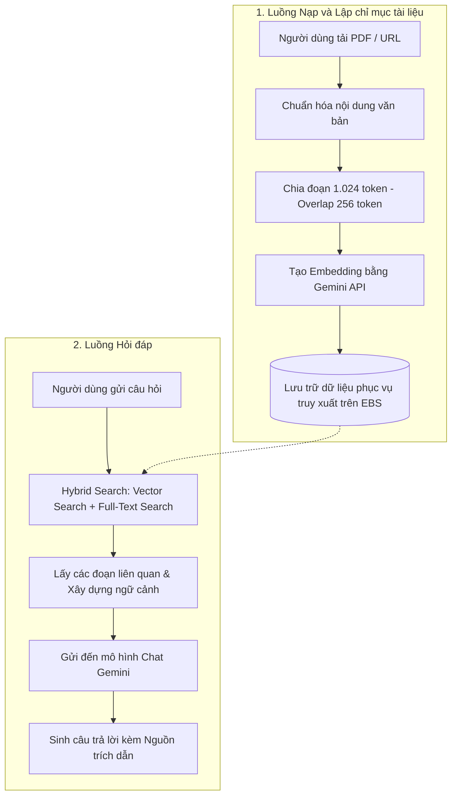
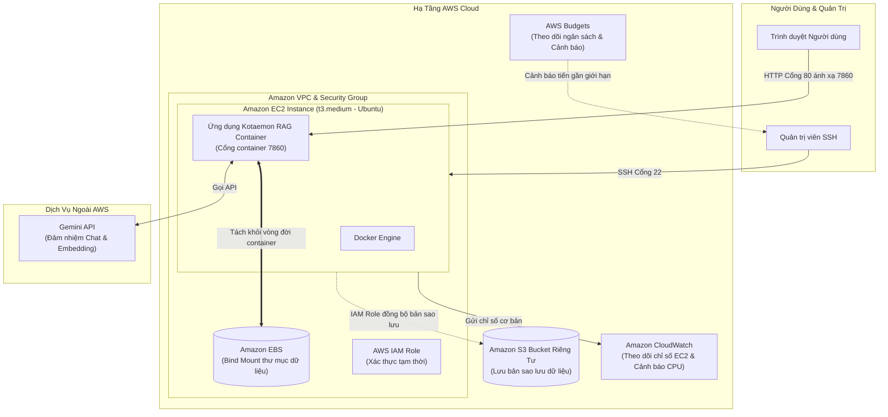

# Proposal
## Triển khai hệ thống RAG Chat Kotaemon trên AWS

---

### 1. Thông Tin Nhóm

Đề tài được thực hiện trong khuôn khổ chương trình **First Cloud AI Journey – AWS Workforce Bootcamp** bởi nhóm sinh viên **Trường Đại học Sài Gòn**.

#### Thành Viên Nhóm:
* **Đàm Thị Ngọc Châu**
* **Phan Thị Hồng Nhiên**
* **Võ Hoàng Kim Quyên**
* **Phan Thị Hải Vân**
* **Lê Gia Hân**

#### Kho Mã Nguồn GitHub:
* Xem repository **FCAJ RAG Chat** trên GitHub: [https://github.com/ngocchau04/fcaj-rag-chat](https://github.com/ngocchau04/fcaj-rag-chat)

---

### 2. Giới Thiệu Tổng Quát

Đề tài đề xuất triển khai hệ thống **RAG Chat Kotaemon trên AWS**. **Kotaemon** là ứng dụng mã nguồn mở cho phép người dùng tải tài liệu và đặt câu hỏi theo nội dung tài liệu đã cung cấp. Nhóm cấu hình mô hình **Gemini** cho chức năng chat và embedding, đóng gói ứng dụng bằng **Docker**, đồng thời xây dựng quy trình triển khai, lưu trữ, sao lưu, giám sát và kiểm soát chi phí trên AWS.

Hệ thống dự kiến chạy trên một máy chủ **Amazon EC2 t3.medium**. Dữ liệu ứng dụng được tách khỏi vòng đời container và lưu trên **Amazon EBS**; bản sao lưu được đồng bộ sang bucket **Amazon S3** riêng tư thông qua **IAM Role**. **Amazon CloudWatch** theo dõi các chỉ số cơ bản của EC2, còn **AWS Budgets** hỗ trợ kiểm soát chi phí. **Gemini API** được sử dụng cho chat và embedding, nhưng đây là dịch vụ bên ngoài AWS.

Kiến trúc được thiết kế cho phạm vi demo và học tập với ưu tiên đơn giản, dễ triển khai và chi phí thấp. Đề tài chưa hướng đến mức sẵn sàng production ngay trong giai đoạn đầu.

---

### 3. Bối Cảnh Và Vấn Đề

Khi ứng dụng RAG chỉ chạy trên máy cá nhân, khả năng truy cập bị giới hạn và việc trình diễn cho nhiều người gặp khó khăn. Việc đưa ứng dụng lên cloud giúp hệ thống có thể được truy cập từ trình duyệt, nhưng đồng thời đặt ra các yêu cầu mới về lưu trữ dữ liệu, sao lưu, phân quyền, giám sát và chi phí.

Container có thể bị dừng, xóa hoặc tạo lại trong quá trình vận hành. Nếu toàn bộ dữ liệu nằm trong lớp ghi của container, các tài liệu tải lên, cơ sở dữ liệu và chỉ mục vector có thể bị mất. Vì vậy, đề tài cần tách dữ liệu quan trọng sang **EBS** và tạo một bản sao độc lập trên **S3**.

---

### 4. Mục Tiêu

* Triển khai giao diện Kotaemon trên Amazon EC2 để người dùng có thể truy cập bằng trình duyệt.
* Đóng gói ứng dụng bằng Docker nhằm tạo môi trường triển khai nhất quán.
* Cấu hình Gemini API cho chức năng hội thoại và tạo embedding.
* Duy trì dữ liệu sau khi container khởi động lại hoặc được tạo lại.
* Sao lưu dữ liệu quan trọng từ EBS sang S3 bằng IAM Role, không lưu Access Key dài hạn trên máy chủ.
* Theo dõi trạng thái EC2 bằng CloudWatch và kiểm soát chi phí bằng AWS Budgets.
* Xây dựng quy trình khởi động, kiểm tra, xử lý lỗi, sao lưu và dọn dẹp tài nguyên.
* Ghi nhận rõ những giới hạn của kiến trúc demo và đề xuất lộ trình cải tiến.

---

### 5. Luồng Xử Lý RAG

Hệ thống RAG gồm hai luồng chính:

1. **Nạp và lập chỉ mục tài liệu:** Người dùng tải PDF hoặc cung cấp URL. Hệ thống chuẩn hóa nội dung, chia tài liệu thành các đoạn khoảng 1.024 token với độ chồng lấn 256 token, tạo embedding bằng Gemini và lưu dữ liệu phục vụ truy xuất.
2. **Hỏi đáp:** Khi nhận câu hỏi, hệ thống thực hiện hybrid search kết hợp vector search và full-text search, lấy các đoạn liên quan, xây dựng ngữ cảnh rồi gửi đến mô hình chat để sinh câu trả lời kèm nguồn trích dẫn.

---

### 6. Kiến Trúc Giải Pháp Đề Xuất

#### Thành Phần Chính:
* **Amazon EC2:** Chạy Ubuntu, Docker và ứng dụng Kotaemon. Cổng 80 của EC2 được ánh xạ đến cổng 7860 của container.
* **Amazon EBS:** Lưu thư mục dữ liệu của Kotaemon thông qua bind mount, giúp dữ liệu không phụ thuộc vào vòng đời container.
* **Amazon S3:** Lưu bản sao dữ liệu trong bucket riêng tư, bật Block Public Access và mã hóa phía máy chủ.
* **AWS IAM:** Cung cấp IAM Role để EC2 truy cập S3 bằng thông tin xác thực tạm thời.
* **Amazon VPC và Security Group:** Kiểm soát kết nối đến EC2, bao gồm SSH cho quản trị và HTTP cho giao diện demo.
* **Amazon CloudWatch:** Theo dõi chỉ số EC2 và cảnh báo khi CPU vượt ngưỡng đã cấu hình.
* **AWS Budgets:** Theo dõi ngân sách và cảnh báo khi mức sử dụng tiến gần giới hạn.
* **Gemini API:** Dịch vụ ngoài AWS đảm nhiệm chat và embedding.

---

### 7. Phạm Vi

#### Trong Phạm Vi:
* Một EC2 chạy Docker và Kotaemon.
* EBS lưu dữ liệu ứng dụng bằng bind mount.
* S3 lưu bản sao dữ liệu trong bucket riêng tư.
* IAM Role cấp quyền EC2 truy cập S3.
* Chỉ số CloudWatch cơ bản và cảnh báo CPU.
* AWS Budgets hỗ trợ theo dõi chi phí.
* Truy cập HTTP qua Public IPv4 cho mục đích demo.
* Gemini API phục vụ hội thoại và embedding.

#### Ngoài Phạm Vi Giai Đoạn Đầu:
* Cụm nhiều máy, High Availability hoặc Auto Scaling.
* HTTPS, tên miền riêng, AWS WAF và Application Load Balancer.
* Amazon ECS Fargate, Amazon ECR, Amazon EFS và NAT Gateway.
* CloudWatch Agent, log ứng dụng tập trung và tracing đầy đủ.
* Sao lưu tự động theo lịch và kiểm thử khôi phục định kỳ.
* Đánh giá định lượng chất lượng RAG bằng bộ câu hỏi chuẩn.

---

### 8. Kế Hoạch Triển Khai

| Giai đoạn | Chi tiết công việc |
|:---|:---|
| **Giai Đoạn 1 – Chuẩn Bị Ứng Dụng** | - Chạy Kotaemon bằng Docker trên môi trường local. - Cấu hình Gemini cho chat và embedding. - Kiểm tra luồng tải tài liệu, lập chỉ mục, hỏi đáp và trích dẫn. |
| **Giai Đoạn 2 – Xây Dựng Hạ Tầng AWS** | - Tạo ngân sách và lựa chọn AWS Region phù hợp. - Khởi tạo EC2 `t3.medium` với EBS và Security Group. - Gắn IAM Role cho EC2 và tạo bucket S3 riêng tư. |
| **Giai Đoạn 3 – Triển Khai Và Lưu Trữ** | - Cài đặt Docker, Git và AWS CLI trên EC2. - Build và chạy Kotaemon container. - Cấu hình bind mount để lưu dữ liệu trên EBS. - Đồng bộ dữ liệu quan trọng từ EBS sang S3. |
| **Giai Đoạn 4 – Giám Sát Và Kiểm Thử** | - Theo dõi EC2 bằng CloudWatch và thiết lập cảnh báo CPU. - Kiểm tra truy cập giao diện, khả năng lưu dữ liệu và sao lưu. - Kiểm tra quyền IAM, trạng thái bucket S3 và nguy cơ lộ API key. - Ghi lại bằng chứng triển khai và hoàn thiện tài liệu vận hành. |

---

### 9. Rủi Ro Và Hướng Giảm Thiểu

* **EC2 thiếu tài nguyên:** Sử dụng `t3.medium`, giới hạn kích thước tài liệu và theo dõi chỉ số hệ thống.
* **Container dừng bất ngờ:** Cấu hình restart policy và kiểm tra log khi khởi động.
* **Mất dữ liệu khi tạo lại container:** Dùng bind mount trên EBS và sao lưu định kỳ sang S3.
* **Gemini API vượt quota:** Giới hạn tần suất gọi, áp dụng retry phù hợp và chuẩn bị phương án dự phòng.
* **API key bị lộ:** Không commit tệp `.env`, giới hạn quyền truy cập và luân phiên key khi cần.
* **Chi phí ngoài dự kiến:** Thiết lập AWS Budgets, dừng EC2 khi không sử dụng và dọn dẹp tài nguyên sau demo.
* **S3 bị công khai:** Bật Block Public Access và rà soát bucket policy.

---

### 10. Kết Quả Kỳ Vọng

* Xây dựng được nguyên mẫu RAG Chat có thể truy cập và trình diễn trên AWS.
* Dữ liệu ứng dụng được lưu bền vững trên EBS thay vì phụ thuộc vào container.
* Có bản sao dữ liệu riêng tư trên S3 và cơ chế truy cập thông qua IAM Role.
* Có khả năng theo dõi trạng thái EC2 và ngân sách chi phí.
* Hình thành quy trình triển khai, kiểm thử, sao lưu, xử lý lỗi và dọn dẹp rõ ràng.
* Tạo nền tảng để nâng cấp lên HTTPS, sao lưu tự động, log tập trung và kiến trúc có khả năng mở rộng trong tương lai.

{}
Đề tài hướng đến một kiến trúc vừa đủ cho mục tiêu học tập và demo: đơn giản, dễ kiểm chứng và có kiểm soát chi phí. Việc nêu rõ giới hạn ngay từ giai đoạn đề xuất giúp nhóm xây dựng lộ trình cải tiến thực tế thay vì mô tả hệ thống như một giải pháp production hoàn chỉnh.
{}

---

* **Tài liệu nguồn:** [Triển khai hệ thống RAG Chat Kotaemon trên AWS](https://github.com/ngocchau04/fcaj-rag-chat)
