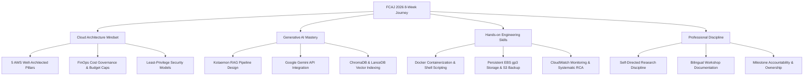

# INTERNSHIP EXPERIENCE SHARING & CONSTRUCTIVE FEEDBACK
## Workforce Bootcamp – First Cloud AI Journey (FCAJ 2026)

{}
**Appreciation Statement:** The **First Cloud AI Journey (FCAJ)** program has been an immensely rewarding and transformative milestone in my academic and professional development. I would like to express my sincere gratitude to the **FCAJ Organizing Committee, Guest Speakers, Saigon University (SGU)**, and especially our dedicated **AWS Mentors** for their continuous guidance, technical insights, and supportive mentorship throughout the 8-week internship.
{}

---

### 1. Comprehensive Program Evaluation

Over the course of 8 weeks utilizing a Blended Learning methodology, the program fostered substantial growth in both engineering competence and professional collaboration:

| Dimension | Practical Observations & Analysis | Evaluation |
|:---|:---|:---:|
| **1. Working Format & Environment** | The balance between in-person milestone meetings and self-directed home study provided flexibility while demanding personal initiative. In-person sessions effectively resolved complex technical hurdles and reinforced team alignment. | **Excellent** |
| **2. Mentor & Coordinator Support** | Mentors demonstrated great dedication, encouraging participants to perform structured Root Cause Analysis (RCA) and validate hypotheses independently rather than providing immediate answers. This pedagogical approach accelerated technical maturity. | **Excellent** |
| **3. Curriculum Relevance & Depth** | The syllabus was structured logically, bridging core AWS services (EC2, S3, IAM, VPC, CloudFront) with advanced topics (Auto Scaling, CloudWatch, Route 53 Resolver) and real-world Generative AI / RAG system design. | **Excellent** |
| **4. Practical Engineering Skills** | Beyond theoretical learning, I successfully containerized the **FCAJ RAG Chat** application with Docker, integrated Google Gemini API, established durable storage on Amazon EBS gp3, and configured automated backups on Amazon S3. | **Excellent** |
| **5. Workplace Culture & Team Spirit** | Fostered professional engineering standards: systematic weekly worklog documentation, transparent teamwork, mutual respect, and strict adherence to cloud security governance. | **Excellent** |

---

### 2. Core Value & Knowledge Gained

* **Transitioning from Theory to Production Systems:**  
  The most valuable achievement was translating an AI prototype from a local environment to an operational cloud architecture on AWS, addressing critical challenges around persistent storage, IAM credentials, and budget guardrails.
* **Confidence in Independent Problem Solving:**  
  The program strengthened my capability to digest complex technical documentation and methodically troubleshoot multifaceted system issues with structured analytical thinking.

---

### 3. Experience Survey & Constructive Suggestions

**1. What are you most satisfied with upon completing the program?**  
> I am most satisfied with completing the **FCAJ RAG Chat** project and delivering a comprehensive bilingual Workshop guide. Seeing the application operate reliably on AWS EC2 with precise source citations and secure S3 backups serves as solid validation of our team's effort.

**2. Would you recommend the FCAJ program to future students?**  
> **Yes.** I would gladly recommend FCAJ to peers passionate about Cloud Computing, DevOps, and Artificial Intelligence. The program provides an authentic, high-impact learning experience aligned with industry standards.

**3. Constructive suggestions for future cohorts:**  
* **Introduce Collaborative Tech Talks / Demo Days:** Incorporate 1–2 informal cross-team sharing sessions for students to exchange architectural perspectives.
* **Expand Serverless & FinOps Modules:** Provide beginner-friendly lab templates exploring Amazon ECS Fargate, AWS Lambda, and proactive budget tracking.
* **Establish an FCAJ Alumni Network:** Build a community bridging past and future interns to share certification insights and career guidance.

**4. Future aspirations and ongoing engagement:**  
> I look forward to staying actively engaged with the FCAJ community and AWS User Groups, participating in technical workshops, and continuing to evolve the RAG Chat architecture toward a fully serverless model.

---

> **Closing Note:** Sincere thanks once again to the **First Cloud AI Journey** organizers and mentors for a high-quality, practical, and inspiring internship experience. Wishing the FCAJ program continued growth as a premier talent incubator for the cloud community.
