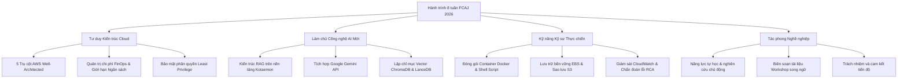

## Chia sẻ trải nghiệm và đóng góp ý kiến
### Chương trình Workforce Bootcamp – First Cloud AI Journey (FCAJ 2026)

{}
**Lời tri ân:** Chương trình **First Cloud AI Journey (FCAJ)** là một hành trình học tập và trải nghiệm nghề nghiệp vô cùng ý nghĩa trên con đường theo đuổi lĩnh vực **Điện toán đám mây & Trí tuệ nhân tạo**. Tôi xin gửi lời cảm ơn chân thành đến **Ban tổ chức FCAJ, các Quý Diễn giả, Trường Đại học Sài Gòn** và đặc biệt là **các anh chị Mentor AWS** đã luôn tận tâm định hướng, chia sẻ kinh nghiệm thực tế và tạo điều kiện thuận lợi nhất cho sinh viên phát triển năng lực.
{}

---

### 1. Đánh giá toàn diện về chương trình

Trải qua 8 tuần học tập nghiêm túc theo mô hình kết hợp (Blended Learning), chương trình đã mang lại những chuyển biến rõ nét về cả tư duy kỹ thuật lẫn kỹ năng làm việc:

| Khía cạnh đánh giá | Nhận xét và Phân tích thực tế | Mức độ hài lòng |
|:---|:---|:---:|
| **1. Môi trường & Hình thức làm việc** | Sự kết hợp giữa các buổi làm việc trực tiếp định hướng cùng thời gian tự nghiên cứu tại nhà tạo không gian chủ động tối đa cho sinh viên. Các buổi trực tiếp giúp tháo gỡ nhanh các vướng mắc kỹ thuật phức tạp và tăng cường tính gắn kết đồng đội. | **Rất tốt** |
| **2. Sự đồng hành của Mentor & BTC** | Mentor hỗ trợ rất tận tình, luôn khuyến khích sinh viên tự tư duy, phân tích nguyên nhân gốc rễ (Root Cause Analysis) và tự tay thử nghiệm giải pháp thay vì chỉ đưa ra đáp án có sẵn. Đây là phương pháp sư phạm hiện đại, giúp sinh viên nâng cao năng lực độc lập. | **Rất tốt** |
| **3. Khung chương trình đào tạo** | Lộ trình được thiết kế khoa học, liền mạch từ kiến thức nền tảng AWS (EC2, S3, IAM, VPC, CloudFront) đến các chủ đề nâng cao (Auto Scaling, CloudWatch, Route 53 Resolver) và ứng dụng thực tiễn vào đề tài Generative AI / RAG. | **Rất tốt** |
| **4. Sự phát triển kỹ năng thực chiến** | Không chỉ dừng ở lý thuyết, tôi đã tự tay đóng gói ứng dụng **FCAJ RAG Chat** bằng Docker, tích hợp Google Gemini API, thiết lập lưu trữ bền vững với Amazon EBS gp3 và cấu hình tự động sao lưu an toàn lên Amazon S3. | **Rất tốt** |
| **5. Văn hóa làm việc và tinh thần đội ngũ** | Rèn luyện tác phong kỹ sư chuyên nghiệp: ghi chép Worklog tuần có hệ thống, làm việc nhóm cởi mở, tôn trọng ý kiến đồng nghiệp và chủ động bảo vệ an toàn thông tin trên đám mây. | **Rất tốt** |

---

### 2. Những giá trị cốt lõi thu nhận được

* **Chuyển hóa từ học lý thuyết sang làm chủ sản phẩm thực tế:**  
  Trải nghiệm đáng giá nhất là việc đưa một ứng dụng AI từ máy tính cá nhân lên môi trường đám mây AWS, giải quyết các bài toán thực tế như lưu trữ bền vững (Persistent Storage), quản lý khóa bí mật qua IAM và kiểm soát chi phí với AWS Budgets.
* **Tự tin tự học và giải quyết vấn đề kỹ thuật:**  
  Chương trình giúp tôi chủ động hơn khi tiếp cận các tài liệu tiếng Anh chuyên sâu và các lỗi hệ thống phức tạp, rèn luyện được sự kiên trì và tư duy logic khi debug hệ thống.

---

### 3. Khảo sát trải nghiệm và Đóng góp xây dựng

**1. Điều bạn cảm thấy hài lòng nhất sau kỳ thực tập?**  
> Điều tôi hài lòng nhất là đã hoàn thành đề án **FCAJ RAG Chat** và xây dựng được bộ tài liệu hướng dẫn Workshop song ngữ đầy đủ. Việc hệ thống vận hành ổn định trên AWS EC2, trích dẫn chính xác từng trang tài liệu và dữ liệu được bảo vệ an toàn trên S3 là minh chứng rõ ràng cho nỗ lực trong 8 tuần qua.

**2. Bạn có sẵn sàng giới thiệu chương trình FCAJ cho sinh viên khóa sau?**  
> **Có.** Tôi sẵn sàng giới thiệu và khuyến khích các bạn sinh viên đam mê Công nghệ Thông tin, Điện toán đám mây và Trí tuệ nhân tạo đăng ký tham gia. FCAJ là một cơ hội học tập giá trị, mang lại trải nghiệm làm việc sát với thực tế doanh nghiệp.

**3. Đóng góp ý kiến tích cực để chương trình ngày càng hoàn thiện hơn:**  
* **Tổ chức thêm các buổi Tech Talk / Demo Day giao lưu:** Có thể bổ sung 1–2 phiên trao đổi ngắn giữa các nhóm để sinh viên học hỏi các ý tưởng kiến trúc từ nhau.
* **Mở rộng tài liệu hướng dẫn về FinOps & Serverless:** Cung cấp thêm các bài lab mẫu về Amazon ECS Fargate, AWS Lambda và tối ưu hóa ngân sách thực hành cho người mới bắt đầu.
* **Xây dựng Mạng lưới Cựu học viên FCAJ (Alumni Network):** Tạo cầu nối gắn kết các thế hệ thực tập sinh để chia sẻ kinh nghiệm học tập, thi chứng chỉ AWS và định hướng nghề nghiệp.

**4. Mong muốn đồng hành và phát triển trong tương lai:**  
> Tôi mong muốn tiếp tục đồng hành cùng cộng đồng FCAJ và AWS User Group trong các hoạt động chia sẻ kỹ thuật, tham gia các sự kiện công nghệ và tiếp tục nâng cấp đồ án RAG Chat lên kiến trúc Serverless trong giai đoạn tiếp theo.

---

> **Lời kết:** Xin chân thành cảm ơn Ban tổ chức chương trình **First Cloud AI Journey** và các anh chị Mentor đã mang đến một kỳ thực tập chất lượng, bổ ích và truyền nhiều cảm hứng. Chúc chương trình FCAJ ngày càng phát triển vững mạnh và tiếp tục đào tạo nhiều nhân lực chất lượng cho cộng đồng công nghệ.
